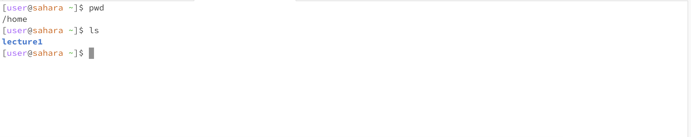
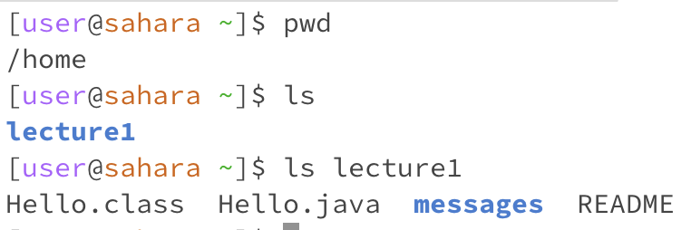
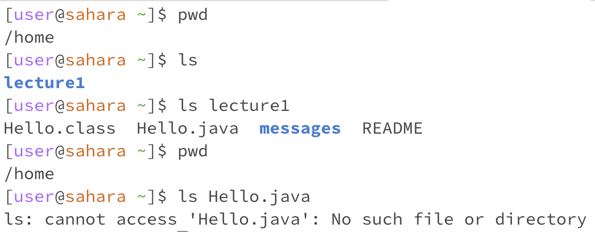

# Milan Suresh Lab Report 1

In this report, I'll be going over what happens we use the commands cd, ls, and cat with no arguments, a path to a directory as an argument, and a path to a file as an argument.

#Let's start with cd

## No Arguments:

## Directory as Argument:

## File as Argument:

# Let's try ls.

## No Arguments:

The current working directory is /main. ls or "list" lists the files/directories in /main, which is just lecture1. This output is not an error.

## Directory as Argument:

The current working directory is still /main. ls lecture1 lists the files/directories in lecture1, which is: Hello.class  Hello.java  messages  README. This output is not an error.

## File as Argument

The current working directory is again /main. ls Hello.java should target Hello.java, but since we are in /main, we cannot access that file. This output is an error.

