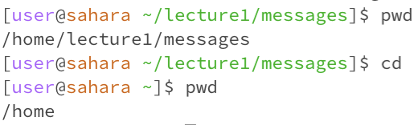

# Milan Suresh Lab Report 1

In this report, I'll be going over what happens we use the commands cd, ls, and cat with no arguments, a path to a directory as an argument, and a path to a file as an argument.

# Let's start with cd

## No Arguments:

The current working directory is `/home/lecture1/messages`. `cd` means changes directory, and it looks like that when we list no arguments, the working directory is changed to `/home`. This is not an error.

## Directory as Argument:

The current working directory is `/home`. `cd` changes directory, so saying `cd lecture1` changes the working directory to `/home/lecture1` as desired. This is not an error.

## File as Argument:

The current working directory is `/home/lecture1`. When we type `cd Hello.java`, we get an error since we can't "change directory" to a file. This is an error.

# Let's try ls.

## No Arguments:

The current working directory is `/home`. `ls` or "list" lists the files/directories in `/home`, which is just `lecture1`. This output is not an error.

## Directory as Argument:

The current working directory is still `/home`. `ls lecture1` lists the files/directories in `lecture1`, which is: `Hello.class  Hello.java  messages  README`. This output is not an error.

## File as Argument

The current working directory is again `/home`. `ls Hello.java` should target `Hello.java`, but since we are in `/home`, we cannot access that file. This output is an error.

# Finally, let's look at cat

## No arguments

The current working directory is `/home`. When we have no arguments, `cat` or "concatenate" does not know what to display the contents of, so it does nothing while it waits for an input. The output is not necessarily an error, but this is an incorrect use of `cat`. Let's see what happens if we type something in after.

The input gets repeated back at us! Your input gets read and spit back as output.

## Directory as Argument

The current working directory is `/home`. When we use `lecture1` as an argument, we get this output because `cat` is supposed to display the contents of a file, and we gave it a directory as the argument. This is an error.

## File as Argument

The current working directory is `/home/lecture1`. When we use `Hello.java` as an argument, we get the correct output, the content of the `Hello.java file`. This is not an error.

## Now, we're done! From this report, I got some more exposure to the command line and learned how to properly use GitHub!

